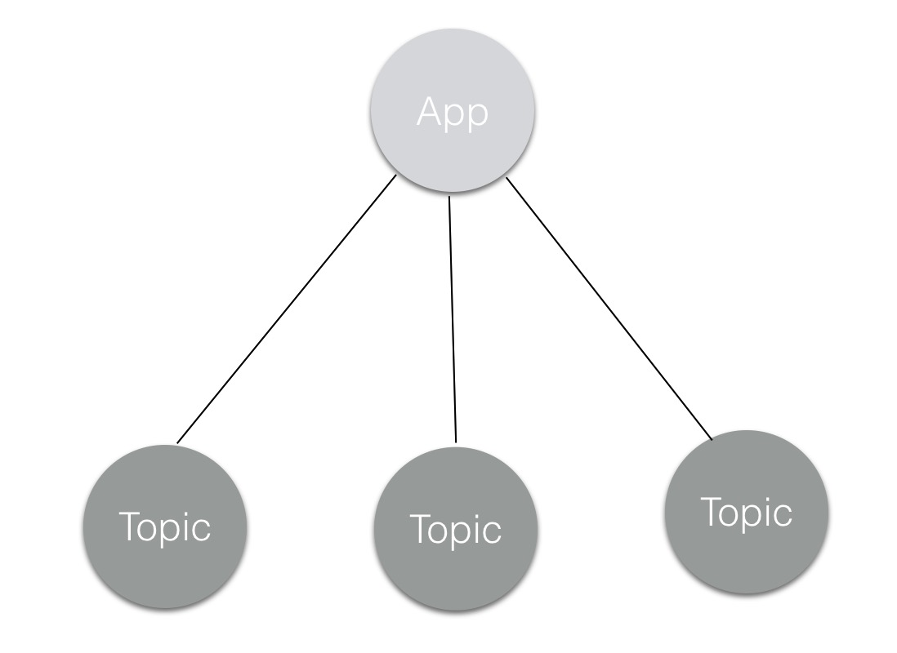
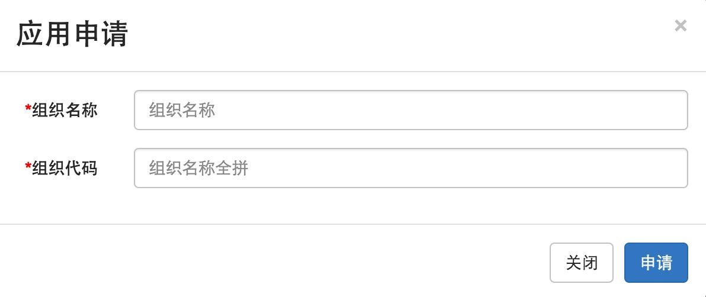
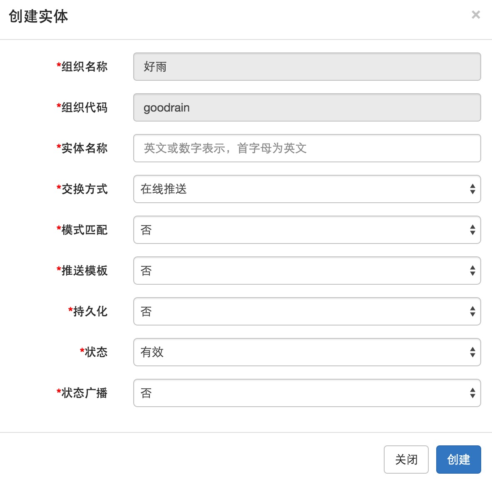

#What is Application?

Applications on behalf of a project, or a functional module;Each application belongs to a company or a department.

#What is Entity?

Entity represents a theme or a topic，Each entity belongs to an organization；It contains name、exchange method、pattern matching, message template, persistence, state, state broadcast attributes.When create an entity, the system will generate a token, the user through the organization code, the topic name and token to subscribe to a topic

#Application and Entity RelationShip

An application has more than one entity；Each entity may use different ways to define the message

#How to create Application?

#How to create Entity?

